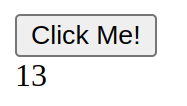

# Simple Go + HTMX example

This example was tested under Ubuntu 24.04 LTS (amd64) with Go 1.22.6.
Though it should work under any OS.

Open the terminal and run:

```bash
sudo apt-get install -y git
git clone https://github.com/arthurazs/go-htmx
cd go-htmx
go run server.go
```

Note: you may run "make run" instead of `go run server.go`.

Open [127.0.0.1:8000](http://127.0.0.1:8000) and click the button as much as you want.


